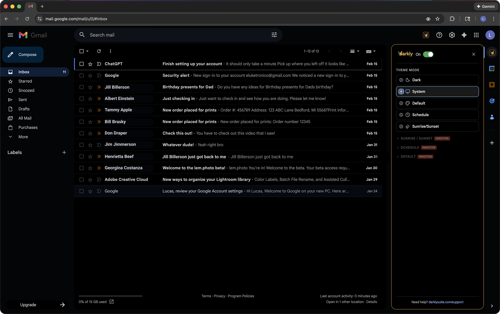
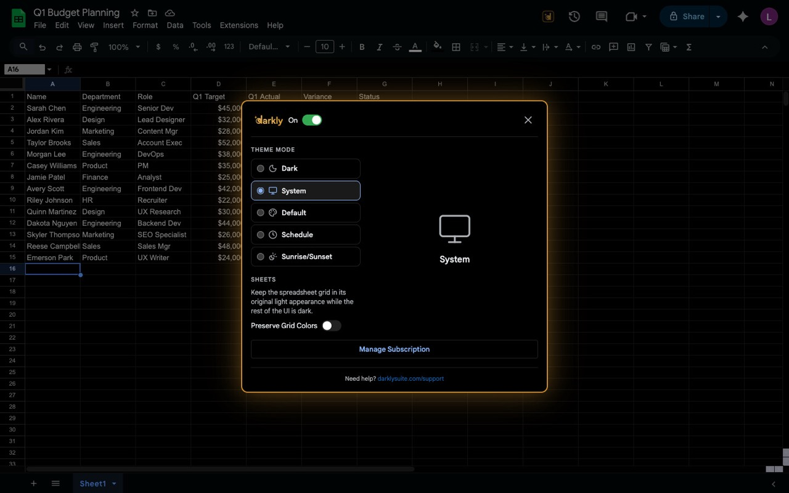
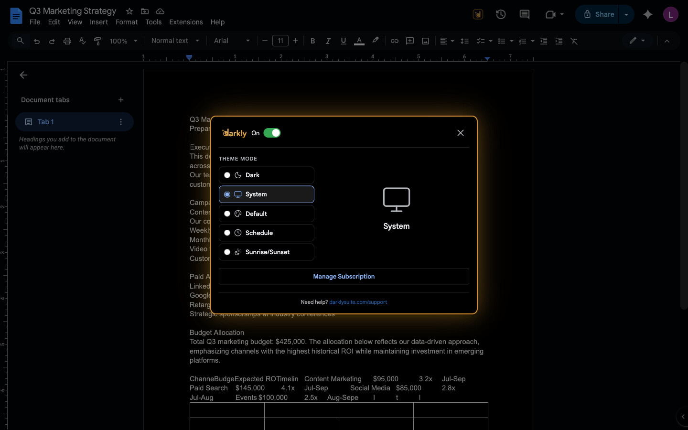

# Darkly Suite

> Unified monorepo for 5 Chrome extensions that bring dark mode to Google Workspace and the rest of the web -- Gmail, Sheets, Docs, a combined bundle, and Browse Darkly for every website -- built from shared code with a single payment backend.

**[darklysuite.com](https://darklysuite.com)** | **[gmaildarkly.com](https://gmaildarkly.com)**

## Chrome Web Store Launch Status

| Extension | In Development | CWS In-Review | CWS Approved | Published | Version |
|-----------|:-:|:-:|:-:|:-:|---------|
| Darkly for Gmail | :white_check_mark: | :white_check_mark: | :white_check_mark: | :white_check_mark: | 1.0.2 |
| Darkly for Sheets | :white_check_mark: | | | | 1.0.0 |
| Darkly for Docs | :white_check_mark: | | | | 1.0.0 |
| Darkly Suite | :white_check_mark: | | | | 1.0.0 |
| Browse Darkly | :white_check_mark: | | | | 1.0.0 |

**Legend:** :white_check_mark: = stage completed. Rightmost checkmark indicates current status.

## Screenshots

### Darkly for Gmail



### Darkly for Sheets



### Darkly for Docs



## Table of Contents

- [Chrome Web Store Launch Status](#chrome-web-store-launch-status)
- [Screenshots](#screenshots)
- [What is Darkly Suite?](#what-is-darkly-suite)
- [Extensions at a Glance](#extensions-at-a-glance)
- [Repository Structure](#repository-structure)
- [Quick Start](#quick-start)
- [Architecture](#architecture)
  - [The Prefix System](#the-prefix-system)
  - [Package Dependency Graph](#package-dependency-graph)
  - [Theme System](#theme-system)
  - [Dark Mode Strategy](#dark-mode-strategy)
  - [Build System](#build-system)
  - [Conflict Detection](#conflict-detection)
- [Extensions In Depth](#extensions-in-depth)
  - [Darkly for Gmail](#darkly-for-gmail)
  - [Darkly for Sheets](#darkly-for-sheets)
  - [Darkly for Docs](#darkly-for-docs)
  - [Darkly Suite Bundle](#darkly-suite-bundle)
- [Landing Pages](#landing-pages)
- [Payment System](#payment-system)
- [Testing](#testing)
- [Development](#development)
  - [Dev Mode vs Production Builds](#dev-mode-vs-production-builds)
  - [Pre-Push Verification](#pre-push-verification)
  - [Chrome Extension Context Rules](#chrome-extension-context-rules)
- [CI/CD](#cicd)
- [License](#license)

## What is Darkly Suite?

Darkly Suite is a family of Chrome extensions providing dark mode for Google Workspace applications. Each extension uses a CSS filter-based inversion strategy with targeted overrides for media elements and site-specific UI chrome, plus a CSS custom properties system for theme presets. Users get system theme sync, time-based scheduling, sunrise/sunset automation, and five color presets out of the box. The extensions are built from a shared codebase in this pnpm monorepo, with a unified Stripe payment backend hosted on Cloudflare Pages.

## Extensions at a Glance

| Extension | Target Sites | CSS Prefix | Key Technology | Manifest Version |
|-----------|-------------|------------|----------------|------------------|
| Darkly for Gmail | `mail.google.com` | `gd` | InboxSDK (sidebar panel, toolbar) | MV3 |
| Darkly for Sheets | `docs.google.com/spreadsheets` | `sd` | Waffle grid observer, MutationObserver toolbar injection | MV3 |
| Darkly for Docs | `docs.google.com/document` | `dd` | Kix canvas observer, forceColorSchemeLight | MV3 |
| Darkly Suite | All three sites + Drive | `ds` | Combined: InboxSDK + Waffle + Kix, unified background worker | MV3 |
| Browse Darkly | All websites (`<all_urls>`) | `bd` | Generic site engine (`@darkly/site-generic`), smart dark detection, per-site memory | MV3 |

## Repository Structure

```
packages/
  core/                  @darkly/core — shared theme engine, storage, payment, UI, conflict detection
  site-gmail/            @darkly/site-gmail — Gmail-specific (InboxSDK, sidebar, overrides)
  site-sheets/           @darkly/site-sheets — Sheets-specific (Waffle grid, toolbar, overrides)
  site-docs/             @darkly/site-docs — Docs-specific (Kix canvas, toolbar, overrides)
  site-generic/          @darkly/site-generic — generic any-website engine for Browse Darkly
  gmail-darkly/          gmail-darkly — standalone Gmail extension (webpack build)
  sheets-darkly/         sheets-darkly — standalone Sheets extension (webpack build)
  docs-darkly/           docs-darkly — standalone Docs extension (webpack build)
  darkly-suite/          darkly-suite-ext — bundle extension for all three sites (webpack build)
  browse-darkly/         browse-darkly — dark mode for every website (webpack build)
  landing-shared/        @darkly/landing-shared — shared landing components, backend functions, admin portal
  landing-suite/         @darkly/landing-suite — darklysuite.com (Vite + React + Cloudflare Pages)
  landing-gmail/         @darkly/landing-gmail — gmaildarkly.com (Vite + React, marketing only)
  landing-sheets/        @darkly/landing-sheets — sheetsdarkly.com (Vite + React, marketing only)
  landing-docs/          @darkly/landing-docs — docsdarkly.com (Vite + React, marketing only)
  landing-browse/        @darkly/landing-browse — browsedarkly.com (Vite + React, marketing only)
build-tools/             @darkly/build-tools — webpack factory + CSS prefix loader
scripts/
  migrate-d1.sh          D1 database migration helper
```

## Quick Start

```bash
# Install all dependencies
pnpm install

# Development (watch mode, paywall disabled)
pnpm dev:gmail           # Darkly for Gmail
pnpm dev:sheets          # Darkly for Sheets
pnpm dev:docs            # Darkly for Docs
pnpm dev:suite           # Darkly Suite bundle
pnpm dev:landing         # darklysuite.com
pnpm dev:landing-gmail   # gmaildarkly.com
```

| Command | Description |
|---------|-------------|
| `pnpm dev:gmail` | Dev mode for Gmail extension (watch + paywall bypass) |
| `pnpm dev:sheets` | Dev mode for Sheets extension (watch + paywall bypass) |
| `pnpm dev:docs` | Dev mode for Docs extension (watch + paywall bypass) |
| `pnpm dev:suite` | Dev mode for Darkly Suite bundle (watch + paywall bypass) |
| `pnpm dev:landing` | Dev mode for darklysuite.com landing page |
| `pnpm dev:landing-gmail` | Dev mode for gmaildarkly.com landing page |

### Loading in Chrome

1. Run one of the `pnpm dev:*` commands above
2. Open `chrome://extensions`
3. Enable "Developer mode" (top-right toggle)
4. Click "Load unpacked" and select the `dist/` directory for the built extension, e.g. `packages/gmail-darkly/dist/`
5. After code changes, webpack watch auto-rebuilds; press Cmd+R on the extensions page to reload

## Architecture

### The Prefix System

Each extension has a unique CSS prefix to prevent class name and CSS variable collisions when multiple Darkly extensions coexist:

| Extension | Prefix | CSS Class Example | CSS Variable Example | Storage Key |
|-----------|--------|-------------------|---------------------|-------------|
| Darkly for Gmail | `gd` | `.gd-settings-toggle` | `--gd-bg-primary` | `gd_preferences` |
| Darkly for Sheets | `sd` | `.sd-settings-toggle` | `--sd-bg-primary` | `sd_preferences` |
| Darkly for Docs | `dd` | `.dd-settings-toggle` | `--dd-bg-primary` | `dd_preferences` |
| Darkly Suite | `ds` | `.ds-settings-toggle` | `--ds-bg-primary` | `ds_gmail_preferences` |
| Browse Darkly | `bd` | `.bd-settings-toggle` | `--bd-bg-primary` | `bd_preferences` |

All shared code is authored with the canonical `darkly-` prefix. Three resolution strategies transform it to the correct product prefix:

1. **CSS files** -- The `darkly-prefix-loader` (a custom webpack loader in `build-tools/`) performs build-time string replacement: `.darkly-` becomes `.{prefix}-`, `--darkly-` becomes `--{prefix}-`, and `data-darkly-` becomes `data-{prefix}-`.

2. **React JSX** -- A runtime `DarklyProvider` context exposes the prefix via a `usePrefix()` hook. Components read the prefix at render time to generate correct class names.

3. **Non-React TypeScript** -- The `ProductConfig` object is injected at construction time. Classes and modules accept the config and use `config.prefix` to build storage keys, DOM attributes, and class names.

### Package Dependency Graph

```
gmail-darkly  <-- @darkly/core + @darkly/site-gmail
sheets-darkly <-- @darkly/core + @darkly/site-sheets
docs-darkly   <-- @darkly/core + @darkly/site-docs
darkly-suite  <-- @darkly/core + @darkly/site-gmail + @darkly/site-sheets + @darkly/site-docs
browse-darkly <-- @darkly/core + @darkly/site-generic

landing-suite <-- @darkly/landing-shared
landing-gmail <-- @darkly/landing-shared
```

The `@darkly/site-*` packages each depend on `@darkly/core`. The extension packages (`gmail-darkly`, etc.) compose the core with their site-specific plugin to produce the final build.

### Theme System

**Modes:** The `ThemeEngine` supports 5 modes:

| Mode | Behavior |
|------|----------|
| `system` | Follows OS light/dark preference via `prefers-color-scheme` |
| `dark` | Always dark |
| `light` | Always light (default appearance) |
| `schedule` | Dark between configurable hours (default 8 PM - 7 AM) |
| `sunrise-sunset` | Dark from sunset to sunrise using geolocation + [sunrise-sunset.org](https://api.sunrise-sunset.org) API |

**Presets:** 6 theme presets (including default):

| Preset | Label | Accent Color |
|--------|-------|-------------|
| `default` | Default Dark | `#8ab4f8` |
| `nord` | Nord | `#8ec5d4` |
| `solarized` | Solarized Dark | `#5aafda` |
| `monokai` | Monokai | `#a6e22e` |
| `catppuccin` | Catppuccin Mocha | `#cba6f7` |
| `rose-pine` | Rose Pine | `#c4a7e7` |

Each preset defines 14 CSS custom properties (`--darkly-bg-primary`, `--darkly-text-link`, etc.) that override the default dark theme values.

**Key API:**

| Method | Behavior |
|--------|----------|
| `engine.apply(theme)` | Visual only -- sets the data attribute, does NOT save to preferences |
| `engine.toggle()` | Toggles light/dark, applies visually AND saves mode to preferences |
| `engine.applyPreset(name)` | Visual only -- sets preset attribute and CSS variables, does NOT save |

### Dark Mode Strategy

All three sites use the same core approach: a CSS filter inversion on `<body>`, with re-inversion on media elements to restore their original appearance.

**Core technique:**

```css
[data-darkly-theme="dark"] body {
  filter: invert(1) hue-rotate(180deg) !important;
  background-color: #fff !important;
}

/* Re-invert media to restore original colors */
[data-darkly-theme="dark"] img,
[data-darkly-theme="dark"] video,
[data-darkly-theme="dark"] canvas {
  filter: invert(1) hue-rotate(180deg) !important;
}
```

**Site-specific details:**

- **Gmail** (`gmail-overrides.css`): InboxSDK integration provides native-feeling toolbar buttons and sidebar panels. Re-inverts profile avatars, attachment thumbnails, and compose elements. Three required files for InboxSDK MV3: `background.js` (imports InboxSDK background), `pageWorld.js` (webpack entry + web-accessible resource), and `content.js`.

- **Sheets** (`sheets-overrides.css`): Waffle grid observer monitors the `#waffle-grid-container` canvas. A "Preserve Grid Colors" toggle (`data-darkly-grid="preserve"`) re-inverts the grid canvas to keep spreadsheet cell colors accurate.

- **Docs** (`docs-overrides.css`): Kix canvas observer monitors `.kix-canvas-tile-content`. Sets `forceColorSchemeLight: true` in its ProductConfig, which forces `color-scheme: light` on the document element to prevent Google's native dark mode from activating and conflicting. A "Preserve Page Colors" toggle (`data-darkly-page="preserve"`) re-inverts the document canvas.

**CSS custom properties** (`themes.css`) define light/dark variable values. The filter inversion handles the bulk of darkening, while the variables are used by the settings panel UI and preset system.

### Build System

Each extension uses webpack with a shared factory configuration:

- **`build-tools/webpack.factory.js`** -- `createDarklyWebpackConfig()` produces the base config with ts-loader (transpileOnly), CSS pipeline with prefix loader, CopyPlugin for static assets, and resolve aliases.

- **`build-tools/darkly-prefix-loader.js`** -- Custom webpack loader that performs three string replacements per CSS file:
  - `.darkly-` to `.{prefix}-` (class names)
  - `--darkly-` to `--{prefix}-` (CSS custom properties)
  - `data-darkly-` to `data-{prefix}-` (data attributes)

- **CopyPlugin with transform** -- Static CSS files are copied to `dist/styles/` with the prefix loader applied during the copy, ensuring all CSS in the output uses the correct product prefix.

- **ts-loader with transpileOnly** -- TypeScript compilation uses `transpileOnly: true` for fast builds. Type checking is separated into `pnpm -r type-check` using `tsc --noEmit`.

- Each extension has its own `webpack.dev.js` and `webpack.prod.js` that merge with the factory output. Dev config sets `__DEV_MODE__=true` (bypasses paywall); prod config sets `__DEV_MODE__=false`.

### Conflict Detection

When both a standalone extension (e.g., Darkly for Gmail) and the Darkly Suite bundle are installed, conflict detection prevents double-injection:

- A `data-darkly-active` attribute on `<html>` acts as a mutex
- The first extension to load calls `claimPage(extensionId)` which sets the attribute
- Subsequent extensions see the attribute, log a warning, and exit without injecting
- `releasePage(extensionId)` removes the claim (used during extension unload)
- `getPageOwner()` returns the current claim holder or `null`

**Claim IDs:**

| Extension | Claim ID |
|-----------|----------|
| Darkly for Gmail | `gd` |
| Darkly for Sheets | `sd` |
| Darkly for Docs | `dd` |
| Darkly Suite (Gmail) | `ds-gmail` |
| Darkly Suite (Sheets) | `ds-sheets` |
| Darkly Suite (Docs) | `ds-docs` |

## Extensions In Depth

### Darkly for Gmail

- **InboxSDK-based**: Uses [InboxSDK](https://www.inboxsdk.com/) for native-feeling Gmail integration -- sidebar settings panel, toolbar button
- **Three required files (MV3 InboxSDK)**: `background.js` (imports `@inboxsdk/core/background.js`), `pageWorld.js` (webpack entry point, listed in `web_accessible_resources`), `content.js` (calls `InboxSDK.load()`)
- **Permissions**: `storage`, `alarms`, `offscreen`, `scripting`
- **Host permissions**: `mail.google.com`, `darklysuite.com`, `api.sunrise-sunset.org`
- **CSS files**: `themes.css`, `gmail-overrides.css`, `settings-panel.css`

### Darkly for Sheets

- **Filter-based inversion** with Waffle grid observer monitoring `#waffle-grid-container`
- **Custom toolbar button** injection via MutationObserver (watches for Sheets toolbar DOM)
- **Centered settings modal** + mini control panel
- **Preserve Grid Colors** toggle: re-inverts the spreadsheet canvas so cell background/text colors display accurately
- **Permissions**: `storage`, `alarms`, `offscreen`
- **Host permissions**: `docs.google.com`, `darklysuite.com`, `api.sunrise-sunset.org`
- **CSS files**: `themes.css`, `sheets-overrides.css`, `settings-panel.css`

### Darkly for Docs

- **Filter-based inversion** with Kix canvas observer monitoring `.kix-canvas-tile-content`
- **`forceColorSchemeLight`**: Sets `color-scheme: light` to prevent Google's native dark mode from activating and conflicting with the filter approach
- **Centered settings modal** + mini control panel
- **Preserve Page Colors** toggle: re-inverts the Kix canvas tiles so document page backgrounds render in their original colors
- **Permissions**: `storage`, `alarms`, `offscreen`
- **Host permissions**: `docs.google.com`, `darklysuite.com`, `api.sunrise-sunset.org`
- **CSS files**: `themes.css`, `docs-overrides.css`, `settings-panel.css`

### Darkly Suite Bundle

- **All three sites in one extension**: Gmail, Sheets, and Docs dark mode combined
- **Per-site content scripts**: `content-gmail.js`, `content-sheets.js`, `content-docs.js`, plus `content-drive.js` (stub for future)
- **Per-site preferences**: `ds_gmail_preferences`, `ds_sheets_preferences`, `ds_docs_preferences`
- **Unified background worker**: Single `background.js` with message/alarm/install listener routing by URL
- **Host permissions**: `mail.google.com`, `docs.google.com/spreadsheets`, `docs.google.com/document`, `drive.google.com`, `darklysuite.com`, `api.sunrise-sunset.org`
- **Permissions**: `storage`, `alarms`, `offscreen`, `scripting`
- **InboxSDK files**: `pageWorld.js` for Gmail integration (listed in `web_accessible_resources`)

## Landing Pages

| Site | Package | Stack | Purpose |
|------|---------|-------|---------|
| [darklysuite.com](https://darklysuite.com) | `@darkly/landing-suite` | Vite + React 19 + Cloudflare Pages | Marketing site + payment backend (Stripe checkout, webhooks, license verification) |
| [gmaildarkly.com](https://gmaildarkly.com) | `@darkly/landing-gmail` | Vite + React 19 + Cloudflare Pages | Static marketing site, no backend |
| (shared) | `@darkly/landing-shared` | React components + Cloudflare Functions | Shared UI components, backend functions, admin portal |

## Payment System

- **Single Stripe account** with 5 products (Gmail, Sheets, Docs, Suite, Browse) x 3 plans (monthly, yearly, lifetime) = 15 prices
- **Checkout flow**: Extension sends user to `darklysuite.com/api/checkout` with product/plan parameters, redirects to Stripe Checkout, webhook writes license to Cloudflare D1
- **License verification**: Extensions call `/api/status` with a token; a Suite license automatically satisfies queries for individual products
- **Rate limiting**: D1-based sliding window (10 requests per 60 seconds per IP)
- **CORS**: Restricted to known extension IDs via `ALLOWED_EXTENSION_IDS` environment variable

## Testing

**410 tests** across 2 test suites (21 test files):

**@darkly/core** (10 test files, 198 tests):
- Theme engine, presets, contrast
- Scheduler (time-based and sunrise/sunset)
- Preferences storage
- Payment gates, client, and checkout poller
- Sun-times geolocation
- Conflict detection

**@darkly/landing-shared** (11 test files, 212 tests):
- Stripe integration
- Webhook processing (binary status model)
- License status endpoint
- Checkout flow
- Auth (Google OAuth)
- Admin license management
- Email notifications (admin + user)
- CORS handling
- Product/price types
- Products configuration

```bash
pnpm -r test             # Run all tests
pnpm --filter @darkly/core test    # Run core tests only
```

## Development

### Dev Mode vs Production Builds

| Command | `__DEV_MODE__` | Paywall | Use Case |
|---------|---------------|---------|----------|
| `pnpm dev:{product}` | `true` | Bypassed (`isPro()` returns `true`) | Local Chrome testing |
| `pnpm -r build` | `false` | Active (Stripe license required) | Pre-push verification, release |

Dev mode runs webpack in watch mode. Production builds overwrite `dist/` with paywall-enabled output. After running `pnpm -r build` for verification, always re-run `pnpm dev:{product}` before testing in Chrome.

### Pre-Push Verification

```bash
pnpm -r lint && pnpm -r type-check && pnpm -r test && pnpm -r build
```

All four checks must pass. CI runs the same commands.

### Chrome Extension Context Rules

| Context | Available APIs | Limitations |
|---------|---------------|-------------|
| Content script | `chrome.runtime.sendMessage`, DOM access | No `chrome.tabs`, `chrome.alarms` |
| Background service worker | Full Chrome API (`tabs`, `alarms`, `storage`, `offscreen`, `scripting`) | No DOM access |

To open a tab from a content script, send `{ type: 'openTab', url }` to the background service worker via `chrome.runtime.sendMessage`.

## CI/CD

### GitHub Actions

**`ci.yml`** -- Runs on every push to `main` and every pull request:

| Job | Command | Depends On |
|-----|---------|------------|
| Lint | `pnpm -r lint` | -- |
| Type Check | `pnpm -r type-check` | -- |
| Test | `pnpm -r test` | -- |
| Build | `pnpm -r build` | Lint, Type Check, Test |

Lint, type check, and test run in parallel. Build runs after all three pass. Concurrency groups cancel in-progress runs on the same branch.

**`deploy-landing.yml`** -- Deploys landing pages to Cloudflare Pages on push to `main`:

- **Change detection**: Only deploys pages whose source files changed (or when `landing-shared` changes, both deploy)
- **Manual dispatch**: Supports `workflow_dispatch` with checkboxes to force-deploy specific pages
- **Targets**: `darklysuite.com` (landing-suite) and `gmaildarkly.com` (landing-gmail)
- **Infrastructure**: Cloudflare Wrangler Action with API token + account ID from GitHub secrets

**Environment**: Node 20, pnpm 9, `--frozen-lockfile` for reproducible installs.

### Deployment Pipeline (Three Paths)

Landing pages deploy to Cloudflare Pages through three independent paths, providing redundancy when any single path fails:

| Path | Trigger | Build Location | Speed |
|------|---------|---------------|-------|
| **Cloudflare git integration** | Push to `main` | Cloudflare's build environment | ~2-3 min |
| **GitHub Actions** (`deploy-landing.yml`) | Push to `main` (change detection) | GitHub Actions runner → `wrangler pages deploy` | ~3-5 min |
| **Manual deploy** | Developer runs `wrangler pages deploy dist` | Local machine (pre-built) | ~30 sec |

**Why three paths?** Cloudflare's automatic git-triggered builds occasionally fail due to build environment issues (observed intermittently, not related to code changes). When this happens, the GitHub Actions workflow provides a second automatic path. If both fail, manual deploy from a local build is the immediate fallback:

```bash
cd packages/landing-suite
pnpm build                                    # Build locally (already verified via pnpm -r build)
npx wrangler pages deploy dist \
  --project-name=darkly-suite \
  --branch=main                               # Push pre-built dist/ directly — skips remote build
```

Manual deploy uploads the pre-built `dist/` directory directly to Cloudflare's CDN, bypassing the remote build step entirely. This is the fastest and most reliable path when you've already verified the build locally.

## License

Copyright © 2026 Lucas McComb. All rights reserved. This source is public so it can be read and evaluated as a work sample — it is not open source, and no right to use, modify, or redistribute it is granted. See [NOTICE](NOTICE).

Third-party dependencies bundled into each extension keep their own licenses and are attributed in the `THIRD-PARTY-LICENSES.txt` that ships in every extension package.
